# Serverless News Data Pipeline

> **AWS Lambda + EventBridge + S3** で構築した、1時間ごとに自動稼働するニュース記事収集パイプライン。
> 初期実装の **Playwright (Container Image) → 公式 RSS (ZIP)** への移行を経て、**実行コスト99.2%削減・データ品質∞倍化** を達成したデータエンジニアリング・ポートフォリオです。

[]() []() []() []() []()

---

## 🎯 このリポジトリで示している実装力 (TL;DR)

「動くものを作れる」ではなく、**「技術選定を実測値で語れる」「ドキュメントで意思決定を残せる」「テストで品質を保証できる」** ことを重視したサーバーレスデータ基盤の作例です。

| 観点 | 採用した解 | 解決した課題 |
|---|---|---|
| **アーキテクチャ判断** | Playwright版 → RSS版へ TCO 評価で移行 ([ADR-001](docs/ADR-001-playwright-to-rss.md)) | 「動いた = 正しい」の罠の回避 |
| **インフラ as Code** | AWS SAM (`template.yaml`) | 完全な再現性、コンソール作業ゼロ |
| **コスト最適化** | ZIP デプロイ + arm64 (Graviton2) + Memory 256MB | 旧実装比 **-99.2%** の GB-秒 |
| **セキュリティ** | IAM 最小権限 (`s3:PutObject` を対象バケット配下のみ) + SSE-S3 暗号化 + パブリックアクセス完全ブロック | 「とりあえず FullAccess」の回避 |
| **テスト** | pytest + moto による S3 モック + feedparser フィクスチャ (24件 / カバレッジ 99%) | サイレント失敗の構造的予防 |
| **データレイク設計** | Hive 互換パーティション (`year=/month=/day=/hour=`) | Athena / Glue Crawler 連携の足場 |
| **観測可能性** | 構造化ログ + CloudWatch メトリクスでの実測比較 | 意思決定を実数値で語れる |

---

## 📊 Playwright 版 vs RSS 版 — 実測値での比較

本プロジェクトの中核となる技術判断は **「初期の Playwright 実装を計測した上で、公式 RSS へ移行した」** こと。実環境にデプロイした両実装の CloudWatch / S3 から取得した実測値:

| 指標 | Playwright版 (legacy) | RSS版 (current) | 削減 / 改善 |
|---|---|---|---|
| **実記事取得数 / 1回** | **0件** (ナビ項目 3件のみ) | **30件** (実ニュース) | データ品質 ∞倍 |
| **出力 JSON サイズ** | 759 B | 14,458 B | **19倍** の情報量 |
| **メタデータ項目** | title, link | + published, source | +2 |
| **Lambda Duration** | 27,578 ms | 1,778 ms | **-94%** |
| **Init Duration (cold start)** | 1,525 ms | 717 ms | **-53%** |
| **Memory Size (allocated)** | 2,048 MB | 256 MB | **-87.5%** |
| **Max Memory Used** | 652 MB | 93 MB | -86% |
| **月間 GB-秒消費 (24回/日 × 30日)** | 約 39,700 | **約 320** | **-99.2%** |
| **デプロイ時間** | 5〜10 分 (ECR push 込) | 約 30 秒 | **-95%** |
| **依存 OS ライブラリ** | 20+ | **0** | 保守コスト劇減 |

なぜこの判断をしたのか、トレードオフは何だったのかは [ADR-001](docs/ADR-001-playwright-to-rss.md) に詳述しています。

---

## 🏗 アーキテクチャ

```mermaid
flowchart LR
    subgraph COLLECT["収集 (Collect)"]
        EB[EventBridge<br/>rate&#40;1 hour&#41;]
        LF[Lambda Function<br/>Python 3.12 / arm64<br/>256MB / 30s]
        GN[Google News<br/>RSS Feed]
        EB -->|trigger| LF
        LF -->|HTTPS GET| GN
        GN -.->|RSS XML| LF
    end

    subgraph TRANSFORM["加工 (Transform)"]
        FP[feedparser<br/>XML → dict]
        CL[cleanse_text&#40;&#41;<br/>空白・改行・制御文字を除去]
        DD[set&#40;&#41; による重複排除]
        LF --> FP --> CL --> DD
    end

    subgraph STORE["蓄積 (Store)"]
        S3[(S3 Bucket<br/>SSE-S3 暗号化<br/>90日ライフサイクル)]
        DD -->|PutObject<br/>Content-Type: application/json| S3
    end

    style COLLECT fill:#E3F2FD,stroke:#1976D2
    style TRANSFORM fill:#FFF3E0,stroke:#F57C00
    style STORE fill:#E8F5E9,stroke:#388E3C
```



S3 に保存されるオブジェクトキーは Hive 互換パーティション形式:

```
google-news-rss/year=2026/month=05/day=09/hour=06/061618.json
```

これにより **Glue Crawler が自動でパーティションキーを認識** し、Athena で `WHERE year='2026' AND month='05'` のフィルタが効くため、後段分析時のスキャン量を大幅に削減できる。

---

## 📦 出力データのサンプル (実物)

```json
{
  "fetched_at": "2026-05-09T06:16:18.119000+00:00",
  "source_feed": "https://news.google.com/rss?hl=ja&gl=JP&ceid=JP:ja",
  "count": 30,
  "articles": [
    {
      "title": "スペインでもハンタウイルス感染疑いで1人が検査 死亡女性と同じ飛行機に搭乗 スペイン当局 - Yahoo!ニュース",
      "link": "https://news.google.com/rss/articles/CBMif0FVX3lxTE9yNTFwdlgyUzZFaFFFa...",
      "published": "2026-05-08T21:32:15+00:00",
      "source": "Yahoo!ニュース"
    },
    {
      "title": "磐越道でのバス死亡事故 運転の男、今年に入り複数回事故起こす 福島県警が経緯捜査 - 産経ニュース",
      "link": "https://news.google.com/rss/articles/CBMidkFVX3lxTE52SENmUGlKYXNNUEJL...",
      "published": "2026-05-09T02:34:04+00:00",
      "source": "産経ニュース"
    },
    {
      "title": "英地方選で労働党が大敗、スターマー氏は続投表明 リフォームUKが各地で勝利 - BBC",
      "link": "https://news.google.com/rss/articles/CBMiX0FVX3lxTE4wcWdmU0FzNFlaTFZW...",
      "published": "2026-05-09T02:56:09+00:00",
      "source": "BBC"
    }
  ]
}
```

`source` (発行元媒体名) が取れるため、後段の Athena では `GROUP BY source` で**媒体別の記事流量分析** が即座に可能。

---

## 🛠 技術スタック

| レイヤ | 技術 |
|---|---|
| **コンピュート** | AWS Lambda (Python 3.12, arm64/Graviton2) |
| **スケジューラ** | AWS EventBridge (rate(1 hour)) |
| **ストレージ** | Amazon S3 (SSE-S3, 90日ライフサイクル) |
| **IaC** | AWS SAM (CloudFormation) |
| **言語/ライブラリ** | Python 3.12, feedparser, boto3 |
| **テスト** | pytest, moto, pytest-cov |
| **CI 候補** | GitHub Actions (今後追加予定) |

---

## 🚀 クイックスタート

### 前提条件

| ツール | バージョン | 用途 |
|---|---|---|
| AWS CLI | v2.x | 認証 / S3確認 |
| AWS SAM CLI | v1.100+ | ビルド・デプロイ |
| Python | 3.12+ | テスト実行 |
| AWS アカウント | — | デプロイ先 |

### 1. クローン

```bash
git clone https://github.com/<your-account>/serverless-scraping-data-pipeline.git
cd serverless-scraping-data-pipeline
```

### 2. ローカルテスト (24件のユニットテスト)

```bash
python3 -m venv .venv
source .venv/bin/activate
pip install -r src/requirements.txt -r requirements-dev.txt

pytest tests/ -v --cov=src --cov-report=term-missing
```

期待: **24 passed / カバレッジ 99%**

### 3. ビルド

```bash
sam build
```

ZIP方式なので 30秒程度で完了。

### 4. デプロイ

```bash
sam deploy --guided
# Stack Name: serverless-news-rss
# Region: ap-northeast-1 (任意)
# その他は基本デフォルトで OK
```

### 5. 動作確認

```bash
# 手動 invoke
aws lambda invoke \
  --function-name cloudpro-news-rss-function \
  --payload '{}' \
  --cli-binary-format raw-in-base64-out \
  /tmp/response.json

cat /tmp/response.json | jq .
```

### 6. S3 で実データ確認

```bash
BUCKET=$(aws cloudformation describe-stacks \
  --stack-name cloudpro-news-rss \
  --query "Stacks[0].Outputs[?OutputKey=='BucketName'].OutputValue" \
  --output text)

aws s3 ls "s3://$BUCKET/google-news-rss/" --recursive

LATEST=$(aws s3 ls "s3://$BUCKET/google-news-rss/" --recursive | sort | tail -1 | awk '{print $4}')
aws s3 cp "s3://$BUCKET/$LATEST" - | jq '.count, .articles[0:3]'
```

### 7. クリーンアップ

```bash
aws s3 rm "s3://$BUCKET" --recursive
sam delete --stack-name cloudpro-news-rss
```

---

## 📁 ディレクトリ構成

```
.
├── src/
│   ├── app.py                    # Lambda ハンドラ (収集・加工・蓄積)
│   └── requirements.txt          # 本番依存 (feedparser, boto3)
├── tests/
│   ├── conftest.py               # pytest fixtures + 環境変数注入
│   ├── test_app.py               # 24件のユニット/統合テスト
│   └── sample_feed.xml           # テスト用 RSS フィクスチャ
├── events/
│   └── scheduled-event.json      # sam local invoke 用イベント
├── docs/
│   └── ADR-001-playwright-to-rss.md   # 意思決定記録
├── legacy/
│   └── playwright/               # 旧 Playwright 実装 (アーカイブ)
│       ├── README.md
│       ├── Dockerfile
│       ├── template.yaml
│       └── src/app.py
├── env.example.json              # ローカル実行用 env テンプレート
├── requirements-dev.txt          # 開発依存 (pytest, moto)
├── template.yaml                 # AWS SAM テンプレート
└── README.md
```

`legacy/playwright/` には初期実装の Playwright + Container Image 版がそのまま残してあります。これは「**移行前後の比較対象**」としてポートフォリオの厚みを増す意図的な設計です。

---

## 🧪 テスト戦略

| テストカテゴリ | 対象 | 件数 |
|---|---|---|
| 純関数 | `cleanse_text`, `parse_published`, `extract_source`, `build_object_key` | 14 |
| RSS パース統合 | `fetch_articles` (実 XML フィクスチャ + feedparser) | 4 |
| AWS 統合 | `upload_to_s3` (moto による S3 モック) | 3 |
| E2E | `lambda_handler` (200 / 204 / 500) | 3 |
| **合計** | | **24** |

### 採用した設計上の工夫

1. **`@lru_cache` による S3 クライアントの遅延初期化** — コールドスタート最適化とテスト分離を両立
2. **pytest fixture を中心とした構成** — moto 5.x の `setup_method` 非互換問題を回避し、ライブラリのバージョン更新に強い
3. **Hive パーティション形式の検証** — `build_object_key` が `year=/month=/day=/hour=` を生成していることをテストで保証

---

## 🗺 ロードマップ

- [x] **Phase B-1**: Playwright版 → RSS版への移行 (本日完了)
- [x] **Phase B-2**: ADR ドキュメント化、README 全面改訂 (本日完了)
- [ ] **Phase B-3**: Athena テーブル定義 + Glue Crawler を SAM に追加
- [ ] **Phase B-4**: JSON → Parquet 変換 Lambda (S3 イベント駆動) を追加し、スキャンコストを更に削減
- [ ] **Phase B-5**: QuickSight ダッシュボードで媒体別記事流量を可視化
- [ ] **Phase B-6**: GitHub Actions による CI (pytest + sam validate) の自動化
- [ ] **Phase B-7**: Step Functions でジョブ依存関係をオーケストレーション化

---

## 📖 ドキュメント

- [ADR-001: Playwright → RSS 移行の意思決定記録](docs/ADR-001-playwright-to-rss.md)
- [Legacy Playwright 版 README](legacy/playwright/README.md)

---

## 📜 ライセンス

MIT License

---

## 🙋 著者について

データエンジニアへのキャリアトランジションを進めているエンジニアの作例です。技術選定の根拠と TCO 視点を重視しています。フィードバック・採用ご相談歓迎です。